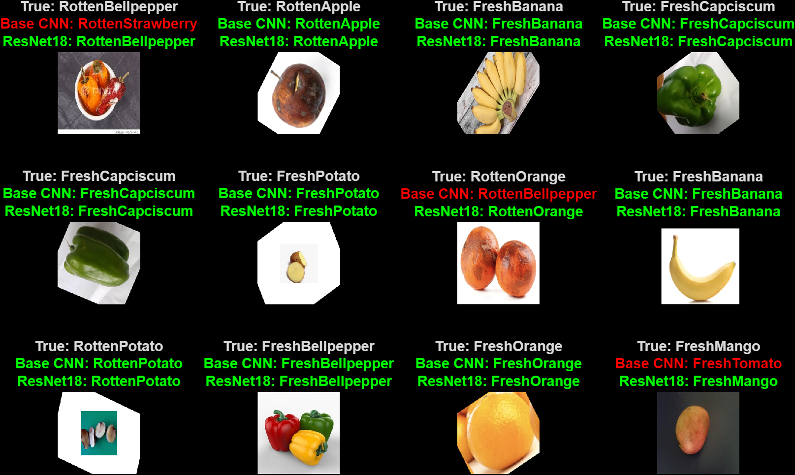
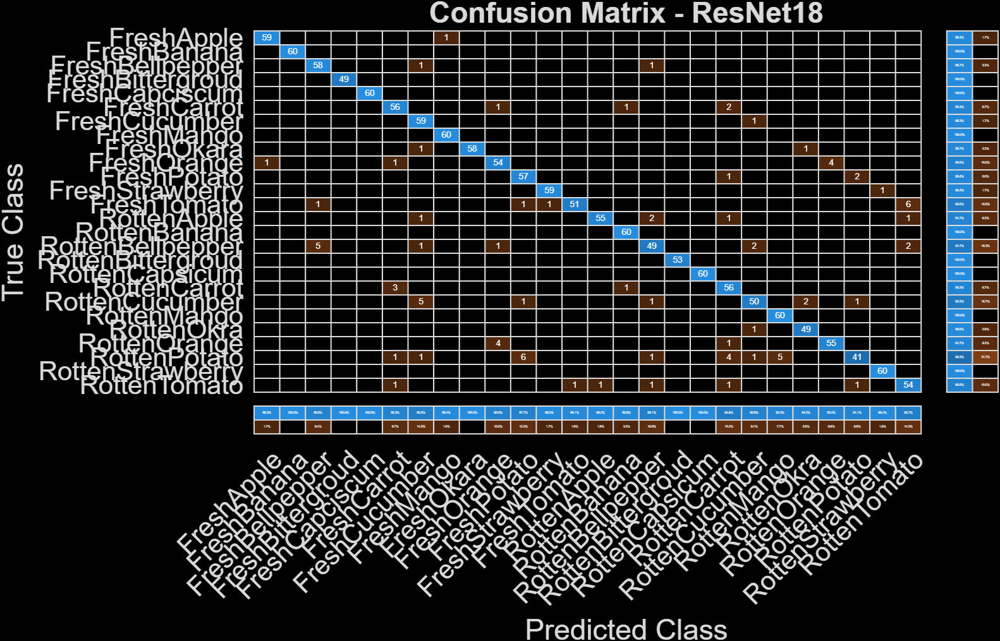
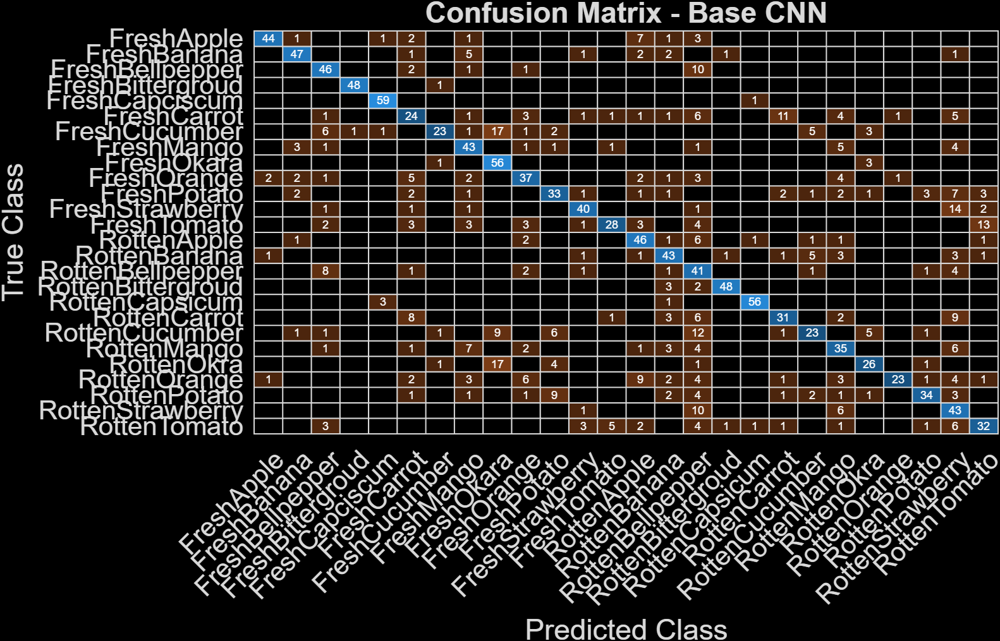

# 🍎 Fruit & Vegetable Freshness Classification (Deep Learning)

This project focuses on classifying fruit and vegetable freshness using deep learning techniques. The system predicts whether a fruit or vegetable is **fresh or rotten** across 26 categories.

---

## 📌 Project Overview

- 📂 Dataset: Fruits and Vegetables Freshness Detection Dataset (Kaggle)
- 🧠 Models:
  - Base CNN (from scratch)
  - ResNet18 (Transfer Learning)
- 🏷️ Classes: 26
- 🖥️ Platform: MATLAB

---

## ⚙️ Technologies Used

- MATLAB
- Deep Learning Toolbox
- Computer Vision Techniques

---

## 🧠 Methodology

- Image preprocessing (resizing to 224×224)
- Data augmentation (rotation, flipping)
- Balanced dataset (~400 images per class)
- Train / Validation / Test split (70/15/15)
- Model training:
  - Base CNN
  - ResNet18 (transfer learning)

---

## 📊 Results

| Model | Accuracy |
|------|--------|
| Base CNN | **65.86%** |
| ResNet18 | **94.12%** |

👉 ResNet18 significantly outperformed the base CNN due to pretrained feature extraction.

---

## 📸 Sample Predictions



---

## 📉 Confusion Matrix (ResNet18)



---

## 📉 Confusion Matrix (Base CNN)



---

## 🚀 Key Insights

- Transfer learning improves performance significantly
- Data augmentation enhances generalization
- CNN struggles with complex multi-class classification
- Balanced dataset improves model stability

---

## ▶️ How to Run

1. Open MATLAB  
2. Run:
   ```matlab
   cnn&resnet18_model.mlx
